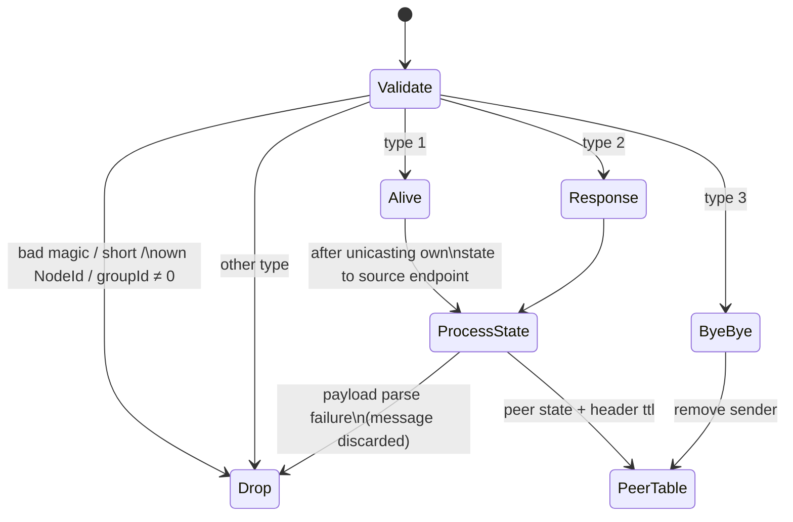

# Chapter 1 — Link Peer Discovery Protocol

| | |
|---|---|
| Spec version | 0.1.0 |
| Upstream reference | Ableton/link @ `902aef95bf94af49746fdda5369b42cdcfa1e6d2` |
| License | CC-BY-4.0 |

This document describes protocol facts determined from observation and analysis for
interoperability purposes. It contains no copied expression from the reference
implementation.

All encodings in this chapter use the common serialization rules of Chapter 0 §4
(big-endian integers, the tagged payload container, 8-byte identifiers).

---

## 1. Protocol summary

Link peer discovery is a gossip protocol over UDP. Each peer periodically multicasts
its complete current state (an *Alive* message); any peer that hears an Alive from a
previously unknown-or-known peer replies with the same state dump as a unicast
*Response* so that the newcomer learns about it without waiting for the next multicast
round. A *ByeBye* message announces departure. Peer liveness is tracked with a
time-to-live (ttl) carried in every state message.

Discovery is the only multicast traffic in the protocol family; everything that
discovery bootstraps (sync measurement, Chapter 2; LinkAudio, Chapter 3) is unicast to
endpoints advertised inside the discovery payload.

## 2. Transport

| Parameter | Value |
|---|---|
| IPv4 multicast group | `224.76.78.75`, UDP port `20808` |
| IPv6 multicast group | `ff12::8080`, UDP port `20808` (transient, link-local scope per RFC 4291) |
| Maximum message size | 512 bytes (see §3.1) |

Per network interface ("gateway", Chapter 0 §2) a peer operates **two** UDP sockets:

1. a **multicast receive socket** bound to port 20808 and joined to the group, and
2. a **unicast socket** bound to an OS-assigned (ephemeral) port, used for *all
   sending* (both multicast transmissions and unicast responses) and for receiving
   unicast responses.

Wire-visible consequence: Alive/ByeBye datagrams have source port = the sender's
ephemeral unicast port and destination port 20808; Response datagrams travel from
ephemeral port to ephemeral port. A peer therefore learns another peer's unicast
discovery endpoint from the *source address* of any message it receives from it.

Multicast loop is left enabled, so multiple peers on one host (including on the
loopback interface) discover each other; self-messages are suppressed by node id
(§5). The reference scans the interface list every **5 seconds** and opens/closes
gateways as interfaces come and go. IPv4 is used on every running interface;
link-local IPv6 is additionally used on interfaces that also have IPv4 (vector
`discovery-ipv6.pcap` shows the IPv6 variant).

## 3. Message framing

Every discovery datagram has this layout:

| Offset | Size | Type | Description |
|---|---|---|---|
| 0 | 8 | bytes | frame magic: `5F 61 73 64 70 5F 76 01` (ASCII `_asdp_v` followed by version byte `0x01`) |
| 8 | 1 | `u8` | message type (§4) |
| 9 | 1 | `u8` | `ttl` — seconds the carried state stays valid (0 for ByeBye) |
| 10 | 2 | `u16` | `groupId` — session group; always 0 in this version |
| 12 | 8 | id | sender's NodeId |
| 20 | varies | — | payload (message-type specific) |

Receiver admission rules (observed, stated as requirements):

- Datagrams shorter than 20 bytes, or not beginning with the 8-byte magic, MUST be
  ignored without error.
- Datagrams whose header NodeId equals the receiver's own NodeId MUST be ignored
  (loopback suppression).
- Datagrams with `groupId` ≠ 0 MUST be ignored.
- Unknown message types MUST be ignored (the receiver keeps listening).

### 3.1 Size limit

The maximum discovery message size is 512 bytes. The reference encoder rejects a
message whose total size is **512 or more** (strict less-than check), so the largest
datagram it can emit is 511 bytes; its receive buffers are 512 bytes, so longer
datagrams are truncated and will fail magic/parse checks only if the cut falls inside
a field. Interoperating senders MUST keep discovery messages ≤ 511 bytes; receivers
MUST accept any message up to 512 bytes. In practice a full peer state is ~107–121
bytes (§6.1), far below the limit.

## 4. Message types

| Value | Name | ttl sent by reference | Payload |
|---|---|---|---|
| 0 | Invalid | — | never transmitted; reserved as the parse-failure marker |
| 1 | Alive | 5 | peer-state payload container (§6) |
| 2 | Response | 5 | peer-state payload container (§6) — identical encoding to Alive |
| 3 | ByeBye | 0 | empty (zero bytes) |

### 4.1 Alive

Sent to the multicast group(s) of the gateway:

- **periodically**, with a nominal period of **250 ms**, derived as
  `ttl × 1000 / ttlRatio` milliseconds with `ttl = 5` (seconds) and `ttlRatio = 20`;
- **immediately on any state change** (timeline, session membership, start/stop
  state, endpoints), subject to a minimum spacing of **50 ms** between sends — a
  state-change broadcast that would violate the spacing is delayed by the remainder.

A gateway with both IPv4 and IPv6 sends one Alive per address family per round.

### 4.2 Response

On receiving an Alive from another peer (valid header, not self, `groupId` 0), a peer
MUST send a Response containing its own current peer state **unicast to the source
endpoint** of the Alive datagram. For IPv6 sources, the destination's scope (zone)
identifier is set to that of the receiving interface before sending.

The Response is sent regardless of whether the Alive's payload parses, and it is sent
*before* the receiver processes the Alive's payload. Responses received are processed
exactly like Alives (state dump) but do not themselves trigger a Response — this is
what terminates the exchange.

### 4.3 ByeBye

Sent to the multicast group(s) when a peer shuts down a gateway (application exit or
Link disable). Header `ttl` is 0 and the payload is empty: the message means only
"forget node `ident` on this gateway". A ByeBye is best-effort; peers that miss it
fall back to ttl expiry (§7).

## 5. Receive state machine

For each gateway, per incoming datagram:

## 6. Peer-state payload

The Alive/Response payload is a payload container (Chapter 0 §4.5). The reference
emits entries in the order below; receivers MUST NOT rely on order. Every entry is
optional on receive — a missing entry leaves the corresponding state at its default
(all-zero) value — but the reference always sends the first four.

| Key (fourcc) | `u32` value | Value size | Value encoding | Meaning |
|---|---|---|---|---|
| `tmln` | `0x746d6c6e` | 24 | tempo `i64` µs/beat, beat origin `i64` µbeats, time origin `i64` µs (ghost time) | session timeline (Chapter 2 §6) |
| `sess` | `0x73657373` | 8 | 8-byte identifier | session membership (founding peer's NodeId) |
| `stst` | `0x73747374` | 17 | `isPlaying` `u8` (0/1), beats `i64` µbeats, timestamp `i64` µs (ghost time) | start/stop state (Chapter 2 §8) |
| `mep4` | `0x6d657034` | 6 | IPv4 address `u32` BE + port `u16` BE | measurement endpoint, IPv4 (Chapter 2 §3) |
| `mep6` | `0x6d657036` | 18 | 16 address bytes + port `u16` BE | measurement endpoint, IPv6 |
| `aep4` | `0x61657034` | 6 | IPv4 address `u32` BE + port `u16` BE | audio endpoint, IPv4 (Chapter 3 §2) |
| `aep6` | `0x61657036` | 18 | 16 address bytes + port `u16` BE | audio endpoint, IPv6 |

Encoding rules (observed):

- **Family switch:** for each endpoint pair (`mep4`/`mep6`, `aep4`/`aep6`) exactly
  one entry is emitted, matching the address family of the gateway the message is
  sent on. Per Chapter 0 §4.5 rule 5, the mismatched-family entry serializes to zero
  bytes and is therefore omitted entirely.
- The measurement endpoint is always advertised (every Link peer runs a measurement
  socket per gateway, Chapter 2 §3). The audio endpoint is advertised only when
  LinkAudio is enabled (Chapter 3 §2); plain Link peers emit neither `aep4` nor
  `aep6`.
- IPv6 endpoint values do not carry a scope (zone) identifier; the receiver
  substitutes the scope of the interface the message arrived on.
- The advertised endpoints are meaningful only on the gateway the message was
  received on; receivers track them per (peer, gateway).

### 6.1 Observed message sizes

With 8 bytes of entry header (key + size) per entry:

| Configuration | Payload | Total datagram |
|---|---|---|
| plain Link, IPv4 gateway | 32 + 16 + 25 + 14 = 87 | **107** bytes |
| LinkAudio enabled, IPv4 gateway | 87 + 14 = 101 | **121** bytes |
| plain Link, IPv6 gateway | 32 + 16 + 25 + 26 = 99 | **119** bytes |

(See vectors `discovery-join-leave.pcap`, `audio-channel-lifecycle.pcap`,
`discovery-ipv6.pcap`.)

## 7. Peer table maintenance

Each gateway keeps a table of known peers with an expiry deadline per peer:

| Event | Effect on (peer, gateway) entry |
|---|---|
| Alive / Response received | entry created or refreshed; deadline := now + header `ttl` seconds; state replaced by the message's payload |
| ByeBye received | entry removed immediately |
| deadline passed | entry removed by the prune timer |
| gateway closed locally | all entries for that gateway removed |

The prune timer is scheduled for the **earliest deadline + 1 second** (padding
against over-eager timeouts); each pruning pass removes every entry whose deadline
has passed and re-arms the timer for the next-earliest survivor. Effective peer
lifetime after the last refresh is therefore between `ttl` and `ttl + 1` seconds plus
timer latency. With the reference's ttl of 5 s and period of 250 ms, a peer survives
~20 missed announcements.

A peer reachable over several gateways has one entry per gateway and disappears from
the application-visible peer set only when its last entry is gone. The
session-membership, timeline, start/stop and audio-endpoint information carried in
peer state feeds the session machinery specified in Chapter 2 §7 and the LinkAudio
endpoint learning of Chapter 3 §2.

## 8. Constants summary

| Constant | Value |
|---|---|
| Frame magic | `5F 61 73 64 70 5F 76 01` (`_asdp_v` + `0x01`) |
| Message types | Invalid=0, Alive=1, Response=2, ByeBye=3 |
| IPv4 group / port | `224.76.78.75` / `20808` |
| IPv6 group / port | `ff12::8080` / `20808` |
| Max message size | 512 bytes (encoder limit 511) |
| ttl | 5 s (ByeBye: 0) |
| ttl ratio / nominal period | 20 / 250 ms |
| Minimum broadcast spacing | 50 ms |
| Prune-timer padding | 1 s |
| Interface rescan period | 5 s |
| Payload entry keys | `tmln` `0x746d6c6e`, `sess` `0x73657373`, `stst` `0x73747374`, `mep4` `0x6d657034`, `mep6` `0x6d657036`, `aep4` `0x61657034`, `aep6` `0x61657036` |
