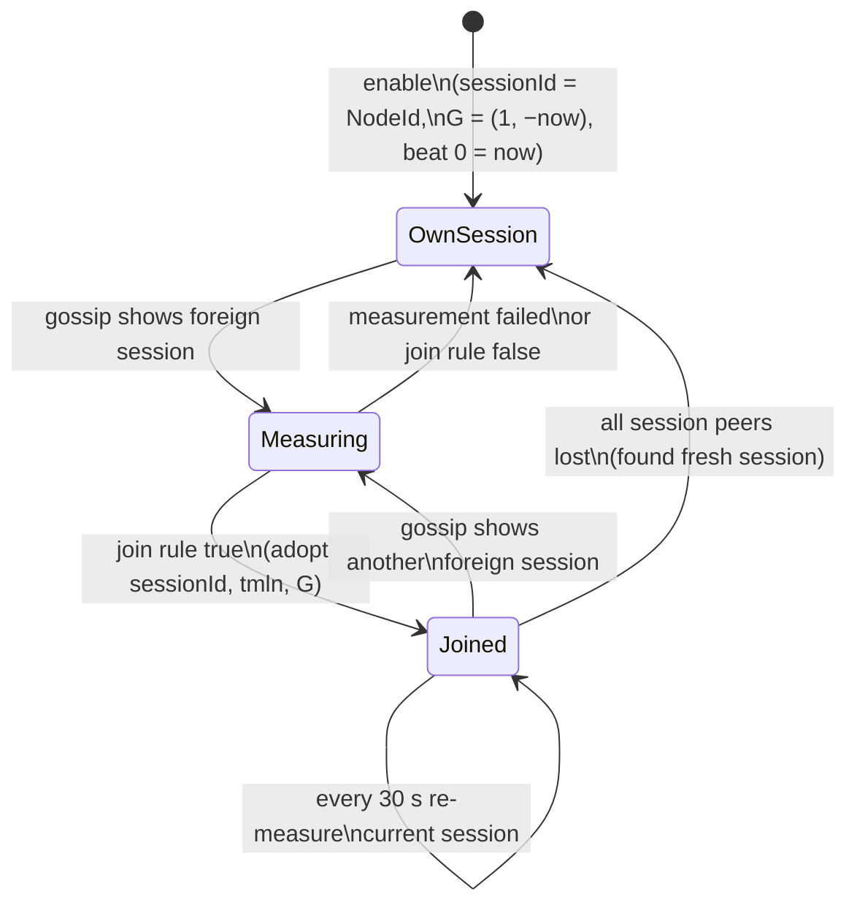

# Chapter 2 — Link Clock Sync and Timeline Protocol

| | |
|---|---|
| Spec version | 0.4.1 |
| Upstream reference | Ableton/link @ `902aef95bf94af49746fdda5369b42cdcfa1e6d2` |
| License | CC-BY-4.0 |

This document describes protocol facts determined from observation and analysis for
interoperability purposes. It contains no copied expression from the reference
implementation. For the rationale of the algorithms standardized here, see F. Goltz,
*"Ableton Link — A technology to synchronize music software"*, Proceedings of the
Linux Audio Conference 2018 (cited below as [Goltz 2018]); that paper is public and
non-GPL.

All encodings use the common serialization rules of Chapter 0 §4. Claims are tagged
with the evidence classes of Chapter 0 §1.1 ([W] wire-observed / [B] behavioral /
[N] normative); every vector under `vectors/` contains sync measurement traffic,
with per-capture facts in `vectors/manifests/`.

---

## 1. Model overview

Peers in a Link session agree on a **session timeline**: a mapping between *beats*
and a shared time base. Because peers have independent, unsynchronized clocks, the
shared time base is a virtual one — called **ghost time** in this specification —
defined per session. Each peer maintains:

1. a **ghost transform** `G` mapping its local microsecond clock to ghost time
   (obtained by measuring another session member, §4–§5), and
2. the **session timeline** `T = (tempo, beatOrigin, timeOrigin)` (§6), gossiped
   through discovery (Chapter 1 §6) and expressed in ghost time.

Local beat position at local time `t` is then `T.beats(G(t))`. Synchronization
quality therefore reduces to how well `G` is estimated; Link measures it pairwise
with a unicast ping/pong protocol and a median filter ([Goltz 2018]).

**Quantum and phase are local.** No quantum value is ever transmitted; phase
alignment between peers with different quanta works because all peers align their
quantum grids to beat 0 of the session timeline ([Goltz 2018]). See §9.

## 2. Ghost time and the ghost transform

A ghost transform is a pair `(slope, intercept)`:

```
ghost(t) = round(slope · t) + intercept          (t, intercept in µs)
host(g)  = round((g − intercept) / slope)
```

In the current protocol version the slope is always **1**; only the offset is
measured. A peer that founds a session (on enable, or when it loses all peers)
creates the transform `(1, −now)`, i.e. ghost time 0 is the founding moment, and
ghost time advances at the rate of the founder's clock.

The ghost transform is never transmitted as such; it is the *output* of the
measurement procedure (§5) on the measuring side, and the thing the responder uses
to answer with its own ghost time (§4.3).

## 3. Measurement transport

Each peer runs one **measurement responder** socket per gateway: a unicast UDP
socket with an OS-assigned port, advertised in discovery as `mep4`/`mep6`
(Chapter 1 §6). The same socket is used to initiate measurements of other peers.

IPv6 endpoint values carry no scope id; an initiator sets the scope of the target
address to that of its own gateway interface before sending.

### 3.1 Message framing

| Offset | Size | Type | Description |
|---|---|---|---|
| 0 | 8 | bytes | frame magic: `5F 6C 69 6E 6B 5F 76 01` (ASCII `_link_v` followed by version byte `0x01`) |
| 8 | 1 | `u8` | message type: 1 = Ping, 2 = Pong |
| 9 | varies | — | payload container (Chapter 0 §4.5) |

Note that unlike discovery (Chapter 1 §3) and LinkAudio (Chapter 3 §3) framing,
measurement messages carry **no ttl, no groupId and no NodeId** — the conversation
is identified only by the UDP 5-tuple. Datagrams shorter than 9 bytes or without the
magic MUST be ignored. Maximum message size is 512 bytes (encoder limit 511, as in
Chapter 1 §3.1).

### 3.2 Payload entries

| Key (fourcc) | `u32` value | Value size | Value | Meaning |
|---|---|---|---|---|
| `__ht` | `0x5f5f6874` | 8 | `i64` µs | **host time** — the *initiator's* local clock at ping transmit |
| `__gt` | `0x5f5f6774` | 8 | `i64` µs | **ghost time** — the *responder's* ghost clock at pong transmit |
| `_pgt` | `0x5f706774` | 8 | `i64` µs | **previous ghost time** — the `__gt` value of the previous pong, echoed back by the initiator |
| `sess` | `0x73657373` | 8 | 8-byte identifier | the responder's current session |

## 4. The ping/pong exchange

### 4.1 Sequence

One *measurement* is a rapid chain of ping/pong round trips against one peer's
measurement endpoint:

```
Initiator                                   Responder
   │ Ping {__ht = h₁}                            │
   ├────────────────────────────────────────────►│
   │            Pong {sess, __gt = g₁} ⧺ {__ht = h₁}
   │◄────────────────────────────────────────────┤
   │ Ping {__ht = h₂, _pgt = g₁}                 │
   ├────────────────────────────────────────────►│
   │   Pong {sess, __gt = g₂} ⧺ {__ht = h₂, _pgt = g₁}
   │◄────────────────────────────────────────────┤
   │ … repeats until enough data (§5) …          │
```

`⧺` denotes byte concatenation: the responder **echoes the entire ping payload
verbatim** (uninterpreted bytes) after its own `sess` and `__gt` entries. Because
payload entries are order-independent and duplicate-free in practice, the result is
one well-formed payload container. The echo is what lets the initiator recover its
own send time (`__ht`) and the previous ghost time (`_pgt`) without keeping
per-ping state.

Datagram sizes and entry shapes [W]: first ping 25 bytes (9 + 16) with `{__ht}`,
its pong 57 (9 + 32 + 16) with `{sess, __gt}` + echo; subsequent pings 41 (9 + 32)
with `{__ht, _pgt}`, pongs 73 (9 + 32 + 32). All four shapes are pinned in every
discovery vector's manifest ("Sync message shapes") and asserted by
`tools/check_vectors.py`.

### 4.2 Initiator behavior

All [B] except as noted; the resulting message shapes and the ~104-ping chain per
measurement are [W] in every discovery vector.

- Send the first ping immediately with `{__ht = now}`.
- On each valid pong for the current measurement, *immediately* send the next ping
  `{__ht = now, _pgt = pong.__gt}` — the chain is paced by the network round trip,
  not by a timer.
- **Retry/timeout:** a 50 ms timer is re-armed on every ping (initial, chain, or
  retry). If it fires (no pong within 50 ms of the most recent ping), send a fresh
  ping `{__ht = now}` (without `_pgt`). The retry budget is **cumulative over the
  measurement's lifetime**: receiving a pong re-arms the timer but does **not**
  restore the budget. After **5** timer-driven retries, the next expiry **fails**
  the measurement and collected data is discarded. Note that each retry also adds
  one in-flight ping *stream* — every pong extends its own chain — so on a slow
  path a measurement runs up to 6 concurrent chains whose pongs interleave; the
  measurement survives as long as inter-pong gaps over 50 ms occur at most 5 times
  in total (see §5.1 for the resulting viability bound).
- **Pong admission:** pongs are not correlated with the eliciting ping, nor with
  the measurement's target endpoint. The reference offers every datagram arriving
  on the gateway's measurement socket to every measurement in progress; a
  measurement accepts any Pong whose `sess` matches the expected session, takes
  its samples entirely from the pong's own and echoed entries (§5), and sends
  that chain's next ping to the *pong's source endpoint*. This statelessness is
  what makes cross-attempt inheritance possible (§5.1). Implementations MAY
  additionally require the pong's source endpoint to match the measured peer's
  measurement endpoint [N]; since pings are only ever sent there, this filters
  nothing but foreign traffic.
- **Session check:** if an accepted pong's `sess` differs from the session id of
  the peer being measured (as known at measurement start), the measurement fails
  immediately. Because the reference fans incoming pongs out to every measurement
  in progress (previous bullet), a pong belonging to one measurement aborts any
  concurrent measurement that expects a *different* session; implementations that
  correlate pongs by source endpoint avoid this mutual-abort behavior [N].

### 4.3 Responder behavior

A responder MUST answer any Ping whose payload is at most **32 bytes** (the size of
a `__ht` + `_pgt` container) with a Pong to the datagram's source endpoint,
containing its current session id (`sess`), its current ghost time (`__gt =
G(now)`), and the verbatim ping payload appended [W: pong = 32 bytes of own entries
+ exact echo, visible in all vectors]. Pings with larger payloads are ignored [B].
The responder is stateless and answers every valid ping, regardless of session
membership [B].

## 5. Offset estimation and filtering

The initiator accumulates *offset samples* (estimates of `ghost − host`, in µs, as
floating-point values). After each pong, with

| Symbol | Source |
|---|---|
| `HT` | initiator clock at pong receipt |
| `GT` | the pong's `__gt` (responder ghost time) |
| `PHT` | the echoed `__ht` (initiator clock at the matching ping transmit) |
| `PGT` | the echoed `_pgt` (responder ghost time of the *previous* pong), when present |

two samples are appended (the first from pong `n`, the second pairing pong `n` with
ping `n+1`'s reference — both are standard midpoint estimators assuming symmetric
network delay):

```
sample₁ = GT − (HT + PHT)/2          (if GT ≠ 0 and PHT ≠ 0)
sample₂ = (GT + PGT)/2 − PHT         (additionally, if PGT ≠ 0)
```

The measurement completes as soon as **more than 100** samples are collected
(i.e. at the 101st; ≈ 51 round trips, well under a second on a LAN). The resulting
ghost transform is:

```
G = (slope = 1, intercept = round(median(samples)))
```

The median across the whole chain discards outliers from asymmetric or delayed
round trips ([Goltz 2018]). The sampling formulas, the >100 threshold, and the
median are [B] — the filter runs inside the initiator and leaves no distinct wire
trace beyond the chain length. Implementations MAY use a different robust estimator
[N]; the wire format does not constrain the filter, only the message exchange.

### 5.1 Operating envelope: round-trip time

The retry rules of §4.2 impose a hard viability bound on any *single* measurement,
and the session machinery of §7.1 relaxes it for session merging as a whole. All
[B] — reference analysis confirmed by runtime experiment (reference-vs-reference
peers on a shaped loopback link, using the conformance harness).

**Single-measurement bound.** The initial ping and the 5 timer-driven retries are
all sent within 250 ms of measurement start (50 ms apart); the timer expiry that
follows the fifth retry fails the measurement at ≈ 300 ms. A measurement can
therefore only complete if its first pong arrives within
`(1 + max retries) × 50 ms ≈ 300 ms` of the initial ping: **a path whose round
trip reaches 300 ms fails every individual measurement attempt.** Below the bound,
bootstrap timeouts consume `floor(RTT / 50 ms)` of the budget before the first
pong arrives, leaving that many concurrent ping chains in flight; the chains then
deliver pongs ≈ 50 ms apart, sustaining the measurement with the remaining budget
as jitter margin. Chain length still means measurement duration grows with RTT
(> 100 samples ≈ 50 round trips split across the chains): fractions of a second
on a LAN, seconds at hundreds of milliseconds RTT.

**Session merging beyond the bound (cross-attempt inheritance).** A failed *join*
measurement causes the foreign session to be forgotten (§7.1); the next Alive or
Response naming that session — nominally within 250 ms (Chapter 1 §4.1) — makes
it brand-new again and triggers a fresh measurement. Because the responder is
stateless (§4.3) and every per-ping quantity is recovered from the pong's echo
(§4.1, §5), pongs elicited by an earlier, already-failed attempt are valid inputs
to the current attempt: they arrive on the same measurement socket and carry the
expected `sess` (§4.2 pong admission). Each attempt contributes up to 6 ping
chains, so successive attempts accumulate in-flight chains until pong gaps drop
under 50 ms and a chain sustains itself. Session merging therefore still
completes well above the 300 ms bound — but probabilistically and slowly rather
than deterministically. Measured with reference peers on an otherwise clean
shaped link: at RTT ≈ 400–600 ms merges typically completed in 3–7 s (versus
sub-second on a LAN), with intermittent failures to complete within an 8 s
window at both operating points. Tempo, start/stop, and timeline gossip
(multicast, Chapter 1) are unaffected by RTT once peers share a session.

**Packet loss consumes the same budget.** A lost ping or pong leaves a > 50 ms
gap in its chain, indistinguishable from a slow path: it costs one unit of the
cumulative 5-retry budget. Over a chain of ~50 round trips (~100 datagrams each
way), sustained loss of a few percent regularly exhausts the budget; at 10 %
loss most single measurements fail and session merges succeed only
intermittently via re-attempts (measured, reference-vs-reference [B]). Discovery
and timeline gossip tolerate loss far better by design — a peer survives ~20
missed Alives (Chapter 1 §7) and every Alive re-carries the full state — so at
loss rates that stall session *merging*, peers already sharing a session keep
following tempo and transport changes.

**Re-measurement starvation above the bound.** The periodic 30 s re-measurement
of the current session (§7.3) has no fast retry loop: a failure schedules the
next attempt 30 s later, by which time no pongs from the failed attempt survive,
so cross-attempt inheritance never occurs for it. Above the single-measurement
bound, a joined peer's re-measurements therefore always fail: its ghost
transform stays frozen at the join-time value and clock drift between session
members is no longer corrected (slope is fixed at 1, §2). The session itself
persists — only drift correction stalls.

## 6. The session timeline (`tmln`)

The 24-byte `tmln` payload value (Chapter 1 §6) is, in order:

| Offset | Size | Type | Description |
|---|---|---|---|
| 0 | 8 | `i64` | tempo, in µs per beat (Chapter 0 §4.7) |
| 8 | 8 | `i64` | beat origin, in micro-beats |
| 16 | 8 | `i64` | time origin, in **ghost time** µs |

with the bijection (all integer µs / µbeats; division rounds to nearest):

```
beats(g) = beatOrigin + (g − timeOrigin) / microsPerBeat
ghost(b) = timeOrigin + (b − beatOrigin) · microsPerBeat
```

Rules, stated as protocol requirements derived from reference behavior:

1. **Tempo range:** tempo values outside 20–999 bpm are clamped by receivers into
   that range [B]. (Senders also clamp; the µs/beat encoding makes exact bpm values
   slightly lossy — e.g. 999 bpm → 60060 µs/beat → 999.000999… bpm — so receivers
   re-clamp after decoding.)
2. **Beat-origin priority:** within a session, a received timeline **replaces** the
   currently held one iff its `beatOrigin` is **strictly greater**. Otherwise it is
   ignored [B]. The beat origin thus acts as a logical clock / priority stamp for
   timeline modifications.
3. **Modification rule:** a peer changing the session timeline (tempo change or beat
   re-anchor) MUST emit a timeline whose `beatOrigin` exceeds the current one. The
   reference uses `max(beats-at-now-on-old-timeline, old beatOrigin + 1 µbeat)`,
   keeping the origin near the present so priority roughly tracks recency. [W:
   `sync-tempo-change.pcap` — its manifest shows each tempo change gossiped with a
   strictly increased beatOrigin, asserted by `check_vectors.py`.]
4. **Beat 0 is the phase reference:** the time origin is the ghost time of beat
   `beatOrigin`; the ghost time of beat 0, `ghost(0)`, anchors every peer's quantum
   grid (§9). Timeline changes preserve this anchoring.
5. A timeline (`tmln`) is interpreted in the context of the `sess` entry of the same
   peer-state message: it is *that session's* timeline proposal.

A new session's timeline starts at `(initial tempo, beat 0, ghost time 0)`; with the
founder's `G = (1, −foundingTime)` this makes beat 0 fall on the founding moment.

## 7. Session identity, election, and merging

A session is identified by the NodeId of its founder (Chapter 0 §2). Every enabled
peer is always a member of exactly one session — initially its own (sessionId =
own NodeId; enabling Link always founds a fresh session and never imports prior
state, so a returning peer cannot hijack an existing session's tempo).

State per peer: the current session `(sessionId, timeline, G)` plus a set of *other*
known sessions seen in gossip.

### 7.1 Discovering a foreign session

When peer-state gossip (Chapter 1 §6) reports a peer whose `sess` differs from the
current session:

1. The observer launches a **measurement** (§4) against that session, choosing as
   target the session's *founding peer* if it is visible (the peer whose NodeId
   equals the session id), otherwise any known member of it.
2. On measurement failure, the foreign session is forgotten (it will be re-measured
   if seen again — with the nominal Alive period this re-attempt loop runs every
   ≈ 250 ms; §5.1 describes how it lets merges complete beyond the
   single-measurement round-trip bound). On success the observer now has `G_new`
   for the foreign session and decides whether to join (§7.2).

### 7.2 Join rule

Let `g_cur = G_cur(now)` and `g_new = G_new(now)` — the current time expressed in
both sessions' ghost times. With `ε = 500,000 µs`:

```
join the foreign session  iff  (g_new − g_cur) > ε
                           or  (|g_new − g_cur| < ε  and  newSessionId < curSessionId)
```

That is: **the session with the greater ghost time wins** — ghost time measures how
long a session has existed, so newcomers always join the older, established session
([Goltz 2018]) — with the byte-wise lesser session id as tie-breaker when the
ghost times are within ε of each other. If the rule does not fire, the peer stays
and the foreign session remains cached with its measurement.

Both sides evaluate the same rule on **independently measured** ghost-time
differences, which are noisy. Away from the ±ε boundary the two evaluations are
anti-symmetric and exactly one side joins; near the boundary, measurement noise can
transiently make both or neither side join. Convergence is still guaranteed: the
post-join membership is re-gossiped immediately, surviving disagreement re-triggers
measurement, and the id tie-break is deterministic [B].

On joining: adopt the foreign `(sessionId, timeline, G)`, reset start/stop state
(§8), and gossip the new membership immediately (Chapter 1 §4.1). Timelines of a
joined session are then maintained per §6 rule 2.

After a join, the abandoned session is **retained** in the set of known sessions
together with its measurement, so re-encountering it in gossip does not trigger a
fresh measurement [B]. Cached foreign sessions' timelines are kept current under the
same beat-origin priority rule as the current session's (§6 rule 2) [B].

### 7.3 Re-measurement and loss of peers

- A peer that has **joined** a foreign session re-measures that session's ghost
  transform every **30 seconds** (target chosen as in §7.1); each pass re-arms the
  timer, and a failed re-measurement of the current session schedules another
  attempt 30 s later rather than abandoning the session [B]. A peer still in the
  session it founded does not re-measure it — its transform is exact by
  construction; the joining members are the measuring side [B]. This bounds clock
  drift between session members (slope is fixed at 1, so drift appears as a slowly
  changing offset). Above the single-measurement round-trip bound the 30 s loop
  never succeeds and drift correction stalls — see §5.1.
- When the last other member of the session disappears (Chapter 1 §7), the peer
  **founds a fresh session**: new random NodeId, sessionId = NodeId, new transform
  `(1, −now)`, and a new timeline constructed so the local beat/tempo continue
  seamlessly. [W: in `discovery-join-leave.pcap` the surviving peer reappears under
  a new NodeId after the other's ByeBye — three NodeIds for two processes in the
  manifest.]

### 7.4 Election state machine (per peer)



## 8. Start/stop state (`stst`)

The 17-byte `stst` payload value (Chapter 1 §6) is, in order:

| Offset | Size | Type | Description |
|---|---|---|---|
| 0 | 1 | `u8` | `isPlaying`: 0 = stopped, nonzero = playing |
| 1 | 8 | `i64` | beats: the session-timeline beat position at which the transport starts/stopped, in µbeats |
| 9 | 8 | `i64` | timestamp: ghost time of the user action that produced this state, in µs |

Propagation rules (reference behavior [B] unless noted, stated as requirements; the
encoding and both transport states on the wire are [W] in `sync-start-stop.pcap`,
asserted by `check_vectors.py`):

1. A received `stst` is considered only if the same message's `sess` matches the
   receiver's current session.
2. It replaces the held start/stop state iff its `timestamp` is **strictly
   greater** (latest user action wins; the ghost-time timestamp gives a session-wide
   total order).
3. A peer that adopts a new `stst` MUST re-gossip it (Chapter 1 §4.1) even if the
   application has start/stop sync disabled — every peer relays, so the state
   reaches members without a direct multicast path. A default (all-zero) `stst` is
   relayed but not surfaced to the application.
4. Joining a session resets the local start/stop state; the joiner picks up the
   session's state from subsequent gossip.

The `beats` field lets a receiving application schedule the transport change on the
beat grid (e.g. start playback at the next quantum boundary after that beat); it is
informational for relays.

## 9. Quantum, phase, and the session beat grid

These equations are shared with Chapter 3 §6 and given here as the normative
definition [B: beat-grid arithmetic of the reference; its session-grid consequences
are [W] in the audio vectors]. All values in beats (µbeats on the wire); `q > 0` is
the local quantum. The two alignment operations are written `alignUp` and
`alignNear` in this specification.

```
phase(b, q)        = b mod q, shifted into [0, q) (negative b handled by adding a
                     sufficient whole multiple of q before the mod; phase(b, 0) = 0)

alignUp(x, t, q)   = x + ((phase(t,q) − phase(x,q) + q) mod q)
                     least value ≥ x having the phase of t

alignNear(x, t, q) = alignUp(x − q/2, t, q)
                     value with t's phase nearest to x (deviation ≤ q/2;
                     ties at exactly q/2 resolve downward)
```

Beat 0 of the session timeline is the origin of every peer's quantum grid: a peer
with quantum `q` places its bar boundaries at session beats `0, q, 2q, …`
([Goltz 2018]). Hence peers with different quanta still phase-align at common
multiples, and the beat value a peer reports to its application for time `t` is
phase-encoded against its own quantum:

```
b_app(t) = alignNear(B(t), B(t) − beatOrigin, q)
           where B(t) = beats(G(t))     (§6 bijection)
```

The inverse mapping (application beat `b` → time) must invert the phase encoding
with the *opposite* tie-break — rounding up at exactly `q/2` — or the two directions
do not compose. The reference computes it as follows [B], and implementations MUST
reproduce the tie-break behavior [N]:

```
r        = b − beatOrigin
cycle    = r − phase(r, q)                       (start of r's quantum cycle)
δ        = alignNear(q − phase(r, q), q − phase(b, q), q)
t_app(b) = ghost⁻¹(time(beatOrigin + cycle + q − δ))    (§6 bijection, then G⁻¹)
```

Chapter 3 §6 builds the origin-independent "session beat time" used by LinkAudio
from the same construction.

## 10. Relationship of host, ghost, and client time

Wire messages use two time bases: local host time (only inside `__ht`, never
interpreted remotely) and ghost time (`__gt`, `_pgt`, `tmln.timeOrigin`,
`stst.timestamp`). Applications additionally see beat values that are pure timeline
arithmetic. An implementation needs exactly one conversion, its own `G`, applied at
the protocol boundary; no other peer's host clock is ever observable.

## 11. Constants summary

| Constant | Value |
|---|---|
| Frame magic | `5F 6C 69 6E 6B 5F 76 01` (`_link_v` + `0x01`) |
| Message types | Ping=1, Pong=2 |
| Max message size | 512 bytes (encoder limit 511) |
| Responder max accepted ping payload | 32 bytes |
| Retry timer / max retries | 50 ms / 5 (budget cumulative per measurement; never restored by pongs) |
| Single-measurement viability bound | first pong within (1 + 5) × 50 ms ≈ 300 ms of measurement start (derived; §5.1) |
| Samples required | > 100 (two per round trip after the first) |
| Offset filter | median |
| Ghost transform slope | 1 (fixed) |
| Session re-measurement period | 30 s |
| Join threshold ε | 500,000 µs |
| Tempo clamp | 20–999 bpm |
| Payload entry keys | `__ht` `0x5f5f6874`, `__gt` `0x5f5f6774`, `_pgt` `0x5f706774`, `sess` `0x73657373` |
| `tmln` / `stst` value sizes | 24 / 17 bytes |

## 12. References

- F. Goltz, "Ableton Link — A technology to synchronize music software,"
  *Proceedings of the Linux Audio Conference 2018*, c-base, Berlin.
  <https://lac.linuxaudio.org/2018/pdf/24-paper.pdf>
