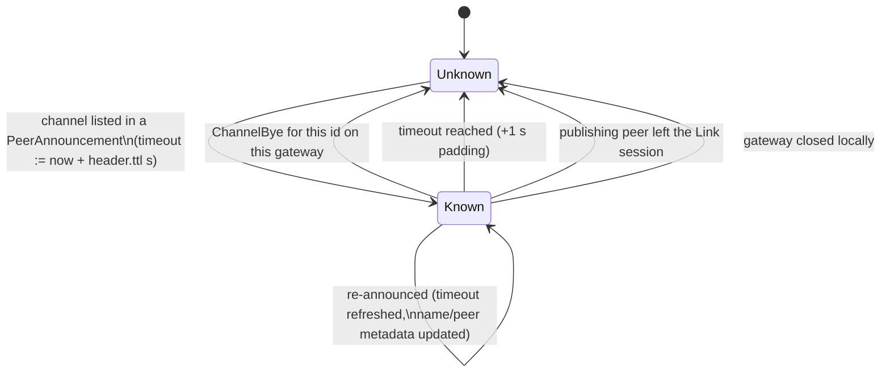
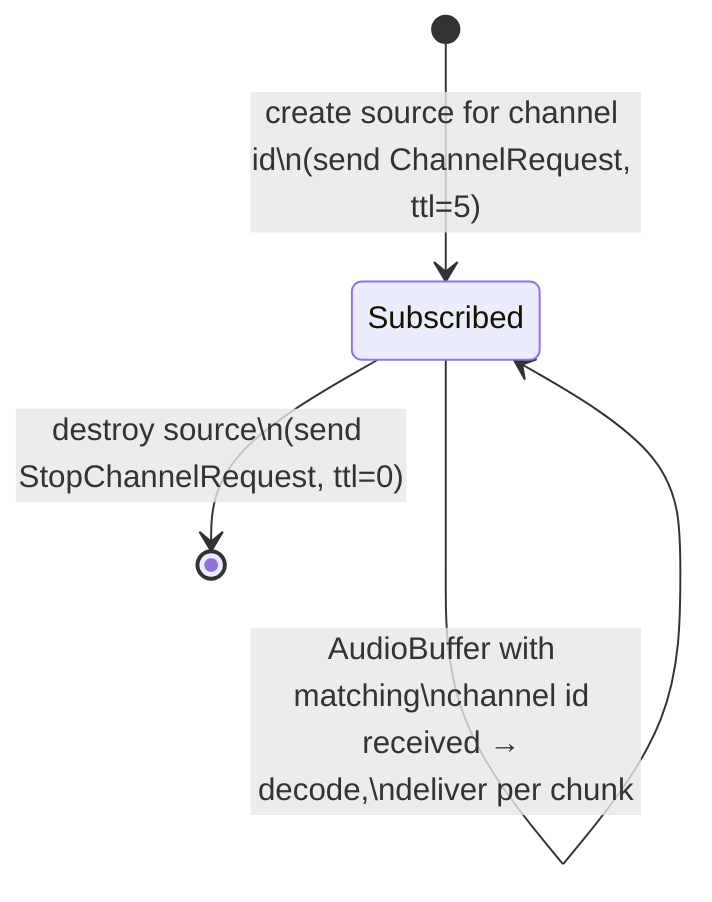

# Chapter 3 — LinkAudio v1 Wire Protocol

| | |
|---|---|
| Spec version | 0.1.0 |
| Upstream reference | Ableton/link @ `902aef95bf94af49746fdda5369b42cdcfa1e6d2` |
| License | CC-BY-4.0 |

This document describes protocol facts determined from observation and analysis for
interoperability purposes. It contains no copied expression from the reference
implementation.

All encodings in this chapter use the common serialization rules of Chapter 0 §4
(big-endian integers, length-prefixed strings and vectors, the tagged payload
container, 8-byte identifiers).

---

## 1. Protocol summary

LinkAudio v1 lets a peer in a Link session publish named audio **channels** and stream
16-bit PCM audio, beat-stamped against the shared Link timeline, to peers that
subscribe. All LinkAudio traffic is **unicast UDP**. There are three sub-functions:

1. **Endpoint advertisement** — piggybacked on Link discovery (Chapter 1): each
   audio-capable peer advertises one audio endpoint per gateway.
2. **Channel control plane** — unicast peer announcements (with embedded ping/pong
   keepalive), channel subscribe / unsubscribe requests, and channel byes.
3. **Audio data plane** — beat-stamped audio buffer datagrams.

Roles per channel: the **sink** (publisher/transmitter) announces and transmits; the
**source** (subscriber/receiver) requests and receives. A sink MUST NOT transmit audio
for a channel until at least one source has an unexpired request for it.

## 2. Audio endpoint advertisement in Link discovery

An audio-capable peer extends the peer-state payload it already sends in Link
discovery (Chapter 1) with one additional payload entry describing its audio endpoint
on the gateway the discovery message is sent from.

| Key (fourcc) | `u32` value | Value size | Value layout |
|---|---|---|---|
| `aep4` | `0x61657034` | 6 | bytes 0–3: IPv4 address as `u32` big-endian; bytes 4–5: UDP port as `u16` big-endian |
| `aep6` | `0x61657036` | 18 | bytes 0–15: IPv6 address, 16 bytes in network order; bytes 16–17: UDP port as `u16` big-endian |

Encoding rules (observed):

- **Presence is the optional flag.** If the peer has no audio endpoint (LinkAudio
  disabled or not supported), *neither* entry is emitted. Plain Link peers therefore
  emit neither, and remain fully compatible.
- Exactly one of `aep4`/`aep6` is emitted when audio is enabled, matching the address
  family of the gateway. (The reference achieves the per-family switch by making the
  mismatched-family entry serialize to zero bytes, which per Chapter 0 §4.5 rule 5
  suppresses the whole entry.)
- A receiver that sees either entry records the endpoint, replacing any previous one
  for that peer on that gateway; a peer-state without either entry clears the
  recorded endpoint for that peer.
- **IPv6 scope:** IPv6 scope identifiers are not transmitted. A receiver of an `aep6`
  endpoint sets the scope (zone) of the address to that of the interface on which the
  advertisement arrived before using it as a destination.
- The endpoint port is OS-assigned (ephemeral); one audio socket exists per gateway.

The measurement endpoint entries `mep4` (`0x6d657034`) / `mep6` (`0x6d657036`) use the
same value layouts and the same family-switch rule (see Chapter 2).

## 3. Message framing

Every LinkAudio v1 datagram has this layout:

| Offset | Size | Type | Description |
|---|---|---|---|
| 0 | 8 | bytes | frame magic: `63 68 6E 6E 6C 73 76 01` (ASCII `chnnlsv` followed by version byte `0x01`) |
| 8 | 1 | `u8` | message type (table below) |
| 9 | 1 | `u8` | `ttl` — validity duration in seconds for the message's content (0 where not applicable) |
| 10 | 2 | `u16` | `groupId` — session group; always 0 in this version |
| 12 | 8 | id | sender's NodeId |
| 20 | varies | — | payload (message-type specific) |

Receiver admission rules (observed, stated as requirements):

- Datagrams shorter than 20 bytes, or not beginning with the 8-byte magic, MUST be
  ignored.
- Datagrams whose header NodeId equals the receiver's own NodeId MUST be ignored.
- Datagrams with `groupId` ≠ 0 MUST be ignored.

### 3.1 Size constants

| Constant | Value | Meaning |
|---|---|---|
| Maximum message size | 1200 | total datagram bytes (chosen to avoid IP fragmentation) |
| Header budget constant | 24 | the constant the reference subtracts from 1200 to budget payloads |
| Maximum payload size | 1176 | 1200 − 24; encoders keep payloads within this |
| Actual encoded header | 20 | magic (8) + type (1) + ttl (1) + groupId (2) + NodeId (8) |
| Maximum name size | 256 | peer and channel name byte limit (see §8) |

Note the 4-byte discrepancy: the on-wire fixed prefix is 20 bytes, but the reference
budgets 24, so the effective payload it *emits* never exceeds 1176 bytes even though
1180 would fit. Interoperating senders SHOULD apply the 1176-byte payload budget.

**Resolved (v0.1.0):** the receive path applies **no** payload ceiling check; an
incoming datagram is bounded only by the receive socket buffer, which is the
1200-byte maximum message size (i.e. up to 1180 bytes of payload). The 24-byte budget
is purely sender-side conservatism. Receivers MUST accept payloads up to 1180 bytes;
senders SHOULD stay within 1176.

### 3.2 Message types

| Value | Name | ttl sent by reference | Payload form |
|---|---|---|---|
| 0 | Invalid | — | never transmitted; reserved as the parse-failure marker |
| 1 | PeerAnnouncement | 5 | payload container: `sess`, `__pi`, `auca`, optional `__ht` |
| 2 | ChannelByes | 5 | payload container: `aucb` |
| 3 | Pong | 5 | payload container: `__ht` |
| 4 | ChannelRequest | 5 | payload container: `chid` |
| 5 | StopChannelRequest | 0 | payload container: `chid` |
| 6 | AudioBuffer | 0 | **bare** audio-buffer structure (no payload container; see §5) |

## 4. Control-plane payload encodings

### 4.1 PeerAnnouncement (type 1)

The payload is a payload container (Chapter 0 §4.5) with these entries:

| Key | `u32` value | Value encoding |
|---|---|---|
| `sess` | `0x73657373` | 8-byte session identifier the sender currently belongs to |
| `__pi` | `0x5f5f7069` | peer info: a single length-prefixed string — the sender's display name |
| `auca` | `0x61756361` | channel announcements: `u32` count, then per channel: length-prefixed string name followed by 8-byte channel id |
| `__ht` | `0x5f5f6874` | OPTIONAL ping: `i64` microseconds — the sender's local clock at transmit time |

Transmission rules (observed):

- Announcements are sent **unicast** to the audio endpoint of every known session peer
  on the gateway (endpoints learned per §2), at a nominal period of **250 ms**
  (derived as ttl × 1000 / 20 with ttl = 5 s), with a minimum spacing of **50 ms**
  between broadcast rounds.
- **Splitting:** if a peer's channel list does not fit within the 1176-byte payload
  budget, the announcement is split into several messages, each carrying the same
  `sess` and `__pi` entries and a disjoint subset of `auca` channels.
- **Ping:** within each per-destination round, exactly the first announcement message
  carries the `__ht` entry; subsequent split messages in the same round do not.
- An announcement also implicitly *refreshes* every channel it lists: the receiver
  restarts that channel's expiry timer at (now + header `ttl` seconds). See §7.3.
- A receiver only processes channel content from announcements whose source UDP
  endpoint matches a known session peer's audio endpoint; however it answers the ping
  regardless (see §4.2).

### 4.2 Pong (type 3) and keepalive metrics

On receiving a PeerAnnouncement containing a `__ht` entry, a peer MUST reply with a
Pong message to the datagram's source endpoint, echoing the `__ht` entry **unchanged**
(same 8-byte microseconds value).

The original announcer computes a round-trip time `RTT = now − echoed_value` using its
own clock (the value never needs to be meaningful to the remote peer). Observed
metrics model, used for selecting the best path to a peer reachable via multiple
gateways:

- A sliding window of the last **10** RTT samples per destination endpoint.
- mean = average RTT in µs; `speed = 10⁶ / mean`
- `jitter = sqrt(variance of samples) + (10⁴ − 10⁴ · n/10)` where `n` is the number of
  samples collected so far (the additive term penalizes endpoints with few samples)
- `quality = speed / (1 + jitter)`

When the same peer is reachable over several gateways, the send path with the highest
`quality` is used for requests and audio (an existing path is only replaced by a
strictly better one).

### 4.3 ChannelRequest (type 4) and StopChannelRequest (type 5)

Both carry a payload container with a single entry:

| Key | `u32` value | Value size | Value |
|---|---|---|---|
| `chid` | `0x63686964` | 8 | the requested channel's 8-byte identifier |

- The requesting peer is identified by the message header's NodeId.
- ChannelRequest header `ttl` declares for how many seconds the request remains valid
  at the sink. The reference sends `ttl = 5` and re-sends the request every **5
  seconds** for as long as the source exists (keepalive by repetition).
- StopChannelRequest is sent once when a source is destroyed, with header `ttl = 0`.
  Its effect is immediate removal of the requester (see §7.2).
- Requests are sent unicast to the audio endpoint of the peer that announced the
  channel, over the best-quality path (§4.2).

### 4.4 ChannelByes (type 2)

Payload container with a single entry:

| Key | `u32` value | Value encoding |
|---|---|---|
| `aucb` | `0x61756362` | `u32` count, then count × 8-byte channel identifiers |

A bye withdraws the listed channels published by the header's sender. Byes are sent:

- when a sink is removed (or renamed away) — the next announcement update first emits
  byes for channels no longer announced;
- for all published channels when the peer's audio messenger shuts down.

Byes are sent unicast to every known session-peer audio endpoint, and are split across
several messages if the id list would exceed the payload budget. A receiver removes
the (channel, gateway) entries named in a bye immediately (see §7.3).

## 5. AudioBuffer (type 6)

### 5.1 Framing peculiarity

Unlike all control messages, the audio payload is **not** wrapped in a payload
container: the structure below begins directly at message offset 20, with no
key/size prefix. The fourcc `_abu` = `0x5f616275` is associated with this structure
as a constant in the reference, but is not written on the wire by the v1 encoding
path. **Resolved (v0.1.0):** confirmed by `vectors/audio-channel-lifecycle.pcap` —
every AudioBuffer datagram's payload begins directly with the 8-byte channel id; no
`_abu` (`5f 61 62 75`) entry header precedes the structure.

### 5.2 Payload layout

Let `N` = chunk count. All offsets relative to the start of the payload (datagram
offset 20):

| Offset | Size | Type | Description |
|---|---|---|---|
| 0 | 8 | id | channel identifier this audio belongs to |
| 8 | 8 | id | session identifier of the sender's Link session |
| 16 | 4 | `u32` | chunk count `N` (MUST be ≥ 1) |
| 20 | 26 × `N` | — | `N` chunk records (§5.3) |
| 20 + 26N | 1 | `u8` | codec (§5.4) |
| 21 + 26N | 4 | `u32` | sample rate in Hz |
| 25 + 26N | 1 | `u8` | number of interleaved channels |
| 26 + 26N | 2 | `u16` | `numBytes` — size of the sample data that follows |
| 28 + 26N | `numBytes` | bytes | encoded samples (§5.5) |

The sample data MUST extend exactly to the end of the datagram: the reference rejects
a buffer when the bytes remaining after the `numBytes` field are either fewer or more
than `numBytes`.

### 5.3 Chunk record (26 bytes)

A chunk maps a contiguous run of frames within this buffer onto the session beat grid.

| Offset | Size | Type | Description |
|---|---|---|---|
| 0 | 8 | `u64` | chunk sequence number; increases by 1 for every chunk the sender creates on this channel (first chunk = 1) |
| 8 | 2 | `u16` | number of frames covered by this chunk |
| 10 | 8 | `i64` | session beat time of the chunk's first frame, in micro-beats (§6) |
| 18 | 8 | `i64` | tempo during this chunk, in microseconds per beat |

Frames are assigned to chunks in order: chunk 0 covers the first `numFrames₀` frames
of the sample data, chunk 1 the next `numFrames₁`, etc. The total frame count of the
buffer is the sum of all chunks' frame counts.

Observed sender chunking rules:

- A new chunk is started when the tempo changes *and* the new material's beat position
  is not exactly contiguous with the previous chunk's end; otherwise material is
  appended to the current chunk.
- The end beat of a chunk is `beginBeats + (numFrames / sampleRate) / (60 / bpm)`
  beats (see §6 for the µs-per-beat ↔ bpm relation); contiguity is judged against
  that value.
- Sequence numbers let a receiver detect loss/reordering per channel.

### 5.4 Codec values

| Value | Name | Meaning |
|---|---|---|
| 0 | Invalid | MUST NOT be transmitted; receivers reject buffers with codec 0 |
| 1 | PCM i16 | uncompressed 16-bit signed PCM (§5.5) |

Receiver validation (observed): codec 0 → reject the buffer. For codec 1 the receiver
additionally checks `total_frames × numChannels × 2 == numBytes` and rejects on
mismatch. Codec values other than 0 and 1 are *accepted by the parser*; the reference
then decodes the sample data as if it were PCM i16 (it has no other decoder and does
not re-check the codec). **Resolved (v0.1.0):** this is confirmed reference behavior;
all AudioBuffers in `vectors/audio-channel-lifecycle.pcap` use `codec = 1`, and no
codec other than 1 is ever transmitted. Because the codec field cannot currently be
used for format negotiation (an unknown value is silently mis-decoded), implementations
SHOULD reject buffers whose codec is neither 0 nor 1 rather than imitate the
reference's fall-through. Codec values remain a v1 extension point reserved for a
future spec version.

### 5.5 Sample encoding (codec 1)

- Each sample is a 16-bit signed integer, transmitted **big-endian** (each sample
  individually byte-swapped to network order; the payload is not a raw little-endian
  PCM blob).
- Samples are **frame-interleaved**: frame 0 channel 0, frame 0 channel 1, frame 1
  channel 0, … The public API supports 1 (mono) or 2 (stereo) channels.
- `numBytes = total_frames × numChannels × 2`.

### 5.6 Audio sizing constants

| Constant | Value | Derivation / meaning |
|---|---|---|
| Non-audio byte allowance | 50 | the reference's fixed allowance for everything in the audio payload other than sample bytes |
| Maximum sample bytes (capacity) | 1126 | 1176 − 50; capacity of the sample area a receiver must accept |
| Sender's per-datagram sample-byte cap | 502 | 576 − 24 − 50; the reference conservatively sizes audio datagrams to RFC 791's 576-byte minimum-reassembly guarantee, i.e. ≤ 251 samples per datagram |

With the 502-byte cap, a stereo 48 kHz stream is sent as ≈ 125-frame datagrams
(roughly one datagram every 2.6 ms per channel).

Note: the fixed non-chunk fields total 28 bytes and each chunk adds 26, so the actual
minimum non-audio overhead with one chunk is 54 bytes, not 50; the reference's chunk
bookkeeping dynamically subtracts the real chunk-list size when computing how many
frames fit. **Resolved (v0.1.0):** the value 50 is a **hand-chosen fixed allowance**,
not a computed minimum — it is intentionally loose headroom for the non-sample fields,
and the encoder subtracts the *actual* chunk-list size at runtime, so correctness does
not depend on 50 being exact. Implementations need not reproduce the constant 50; they
need only ensure each datagram's total size stays within the message limit. The
constant matters only as the basis for the capacity figures below.

### 5.7 Transmission conditions

- A sink transmits an AudioBuffer datagram to **each** peer with an unexpired request
  for the channel (one unicast copy per requester), via that peer's best-quality path.
- A sink MUST NOT transmit when it has no unexpired requesters.
- The reference also suppresses transmission of buffers committed with tempo ≤ 0
  (used internally to mark discarded buffers).
- AudioBuffer messages carry header `ttl = 0`.

## 6. Beat-time alignment

### 6.1 The session beat grid

Each peer holds a Link timeline `T = (tempo µs/beat, beatOrigin µbeats, timeOrigin µs)`
with the bijection:

```
beats(t)  = beatOrigin + (t − timeOrigin) / microsPerBeat
time(b)   = timeOrigin + (b − beatOrigin) · microsPerBeat
```

Different peers in one session have different local clocks and different timeline
origins, but agree (after sync, Chapter 2) on tempo and on *phase relative to the
quantum*. The wire beat values in audio chunks are expressed on a **session beat
grid** that is origin-independent, so any session member can interpret them.

### 6.2 Phase arithmetic

For beat value `b` and quantum `q` (both in beats; `q > 0`):

```
phase(b, q)              ∈ [0, q): b mod q, computed so negative b is handled
                          by shifting b up by a whole multiple of q first.

nextPhaseMatch(x, t, q)  = x + ((phase(t,q) − phase(x,q) + q) mod q)
                           (least value ≥ x with the phase of t)

closestPhaseMatch(x,t,q) = nextPhaseMatch(x − q/2, t, q)
                           (value with the phase of t nearest to x; deviates ≤ q/2)
```

A peer's **session offset** for quantum `q` is:

```
Δ = closestPhaseMatch(B0, B0 − beatOrigin, q)    where B0 = beats(timeOrigin)
```

i.e. the phase-encoded beat value the local timeline assigns to its own time origin.
Because all session members share tempo and quantum phase, `localBeats − Δ` is the
same quantity on every peer: the session beat time.

### 6.3 Sender side

When a sink commits a buffer whose first frame the application rendered at local beat
time `b_local` (the same beat value used for local playback, under quantum `q`):

```
wire beginBeats = b_local − Δ_sender        (encoded as i64 micro-beats)
wire tempo      = round(60·10⁶ / bpm)       (µs per beat)
```

### 6.4 Receiver side

A receiver first checks the buffer's session id against its own; if they differ, the
beat mapping is undefined (the reference exposes no mapping in that case). Otherwise,
for chunk begin beat `b_wire` and quantum `q`:

```
b_local(receiver) = b_wire + Δ_receiver
t_local           = time(b_local)                       (schedule of first frame)
b_end             = b_wire + (numFrames / sampleRate) · (bpm / 60)
                    where bpm = 60·10⁶ / wire_tempo
```

Frame `k` within a chunk lies at session beat
`b_wire + (k / sampleRate) · (bpm / 60)` and hence at local time
`time(b_wire + Δ_receiver + (k/sampleRate)·(bpm/60))`.

This is what produces automatic latency compensation: sender and receiver each map
between their own clock and the shared beat grid, so network and buffering delays
shift only *when* a datagram arrives, never *where* its samples belong on the grid. A
receiver schedules samples at their beat positions; samples whose local time has
already passed are late and may be dropped or partially played at the implementation's
discretion (the reference leaves scheduling to the application).

## 7. Channel lifecycle

### 7.1 End-to-end sequence

1. Peers join a Link session (Chapters 1–2). Audio-capable peers advertise audio
   endpoints (§2).
2. Each audio peer unicasts PeerAnnouncements (≈4/s) to every session peer's audio
   endpoint, listing its published channels; pings/pongs measure path quality.
3. A peer wishing to receive a channel sends ChannelRequest (and re-sends every 5 s).
4. The sink transmits AudioBuffer datagrams to all unexpired requesters.
5. Subscription ends via StopChannelRequest, by request expiry (no refresh within ttl
   seconds), or when the publisher withdraws the channel (ChannelByes / announcement
   timeout / leaving the session).

### 7.2 Sink-side requester state (per channel, per requesting peer)

```mermaid
stateDiagram-v2
    [*] --> Absent
    Absent --> Active : ChannelRequest received\n(expiry := now + header.ttl s)
    Active --> Active : ChannelRequest received\n(expiry refreshed)
    Active --> Absent : StopChannelRequest received
    Active --> Absent : expiry reached\n(pruned; timer fires at\nearliest expiry + 1 s)
```



- A requester is keyed by the requesting peer's NodeId; a new request from the same
  peer replaces its previous entry.
- While at least one requester is Active, every committed buffer is encoded and sent
  to each Active requester. With zero requesters the sink is silent.
- Expiry pruning runs on a timer scheduled 1 second after the earliest expiry
  (padding against over-eager timeouts), so effective requester lifetime is between
  `ttl` and `ttl + 1` seconds plus timer latency.

### 7.3 Subscriber-side channel knowledge (per channel id, per gateway)



- Channel entries are tracked per (channel id, gateway); a channel disappears from the
  application-visible list only when its last gateway entry is gone.
- When channels are removed, per-peer send paths with no remaining channels are also
  dropped.
- Announcement processing requires the datagram's source endpoint to match an audio
  endpoint previously learned through discovery (§2); announcements from unknown
  endpoints do not create channels (their pings are still answered, §4.2).

### 7.4 Source (subscriber object) behavior



A receiving peer dispatches an incoming AudioBuffer to the local source whose channel
id matches; buffers for channels with no local source are discarded after parsing.
Each chunk of a buffer is delivered to the application as a separate (frames,
beginBeats, tempo, count, sessionId, sampleRate, numChannels) unit.

## 8. Peer and channel names

- Maximum name length is **256 bytes**. The reference API truncates longer peer and
  channel names to 256 bytes before they ever reach the wire.
- Names are length-prefixed strings (Chapter 0 §4.2), opaque bytes, no terminator.
- Names are display-only and may change over the lifetime of a peer/channel; the
  8-byte identifiers are the stable keys.
- **Resolved (v0.1.0):** the 256-byte cap is **sender-side only** (the public API
  truncates before transmit). The receive path applies no name-length check: a name is
  decoded as a length-prefixed string (Chapter 0 §4.2) bounded only by the enclosing
  payload. A receiver therefore accepts names longer than 256 bytes, up to the payload
  budget. Implementations MAY impose their own display-length cap but MUST parse the
  full length-prefixed field to stay byte-aligned with the rest of the payload.

## 9. Forward-compatibility behavior (observed in the reference)

| Situation | Observed behavior |
|---|---|
| Unknown message type (7–255) | message logged and ignored; listener continues |
| `groupId` ≠ 0 | entire message ignored |
| Header NodeId == own NodeId | entire message ignored |
| Unknown payload-container entry key | entry skipped via its size field |
| Payload entry larger than remaining bytes | whole payload abandoned, message dropped |
| Recognized entry not consuming exactly its declared size | parse error, message dropped |
| AudioBuffer with zero chunks | rejected |
| AudioBuffer with codec 0 | rejected |
| AudioBuffer with unknown nonzero codec | parsed and decoded as PCM i16 (no dedicated check); implementations SHOULD reject — see §5.4 |
| AudioBuffer where remaining bytes ≠ `numBytes` | rejected |
| Malformed announcement / request payloads | message logged and ignored |

## 10. Constants summary

| Constant | Value |
|---|---|
| Frame magic | `63 68 6E 6E 6C 73 76 01` (`chnnlsv` + `0x01`) |
| Message types | Invalid=0, PeerAnnouncement=1, ChannelByes=2, Pong=3, ChannelRequest=4, StopChannelRequest=5, AudioBuffer=6 |
| Max message size | 1200 bytes |
| Header budget / actual header | 24 / 20 bytes |
| Max payload | 1176 bytes |
| Max name size | 256 bytes |
| Announcement/request ttl | 5 s |
| Announcement nominal period | 250 ms (ttl·1000/20) |
| Announcement minimum spacing | 50 ms |
| Source re-request period | 5 s |
| Prune-timer padding (requesters and channels) | 1 s |
| Ping RTT window | 10 samples |
| `aep4` / `aep6` | `0x61657034` / `0x61657036` |
| `sess` / `__pi` / `auca` / `aucb` / `chid` / `__ht` | `0x73657373` / `0x5f5f7069` / `0x61756361` / `0x61756362` / `0x63686964` / `0x5f5f6874` |
| `_abu` (defined; not observed on wire) | `0x5f616275` |
| Chunk record size | 26 bytes |
| Codec PCM i16 | 1 |
| Non-audio allowance / sample capacity / sender sample cap | 50 / 1126 / 502 bytes |
| Beat value unit | micro-beats (beats × 10⁶), `i64` |
| Tempo unit | µs per beat, `i64` |

## 11. Open questions (tracking list)

Resolved at v0.1.0 (see CHANGELOG for the per-question verdict):

1. **Resolved** — `_abu` is **not** written on the wire; AudioBuffer payloads begin
   bare with the channel id. Confirmed by `vectors/audio-channel-lifecycle.pcap`.
   See §5.1.
2. **Resolved** — receivers enforce **no** payload ceiling beyond the 1200-byte
   socket buffer (≤1180 payload); the 24-byte budget is sender-side only. See §3.1.
3. **Resolved** — the 50-byte allowance is a hand-chosen fixed constant, not a
   computed minimum; the encoder subtracts the real chunk-list size at runtime.
   See §5.6.
4. **Resolved** — the 256-byte name cap is sender-side only; receivers accept longer
   names (length-prefixed, bounded by the payload). See §8.
5. **Resolved** — the reference parses unknown nonzero codecs and decodes them as
   PCM i16; only codec 1 is ever transmitted. Implementations SHOULD reject unknown
   codecs. See §5.4.
6. **Resolved** — `groupId` is a reserved field; the reference sends 0 and drops any
   nonzero value. All captured traffic uses `groupId = 0`. Implementations MUST send 0
   and MUST ignore messages with a nonzero `groupId`. See §3 and §9.
7. **Resolved** — duplicate payload-container entries are never emitted; receivers
   apply last-one-wins. Senders MUST NOT emit duplicates. See Chapter 0 §4.5 rule 7.

Deferred:

8. **OPEN QUESTION:** cross-host usability of advertised IPv6 (`aep6`) addresses given
   that scope ids are not transmitted (receiver substitutes its own interface scope).
   Requires the `discovery-ipv6.pcap` vector, which the v0.1.0 capture environment
   could not produce (no interface with both IPv4 and link-local IPv6). The capture
   script emits this vector automatically where such an interface exists; the question
   is carried forward to the next release.
